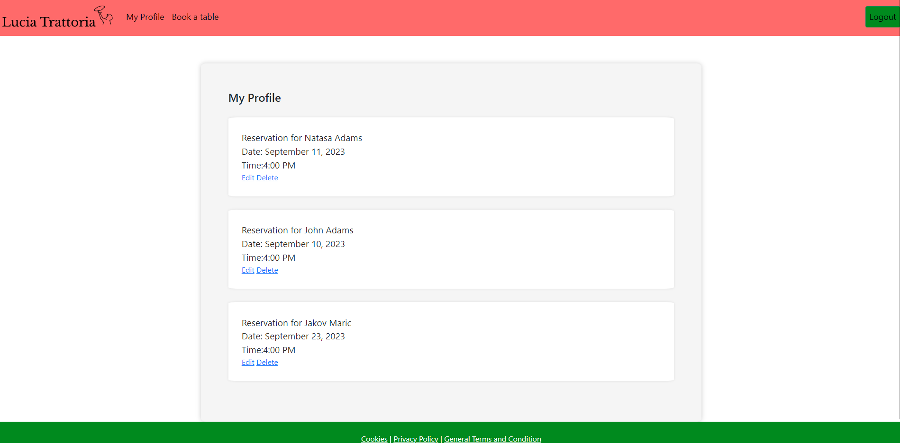

# Lucia Trattoria #
## About ##
A restaurant booking app built using Django for Italian restaurant called Lucia Trattoria. The application allows user to register or login and make reservation of a table. The reservations can be viewed in My Profile area and then edited or delted by the user as required.

## Table of Contents ##
* [About](#About)
* [User Stories](#User_Stories)
* [Design](#Design)
  * [Color Scheme](#Color_Scheme)
  * [Typography](#Typography)
  * [Imagery](#imagery)
  * [Layout](#Layout)
* [Database Schema](#Database_schema)
* [Features](#Features)
  * [Home Page](#Home_page)
  * [Navigation](#Navigation)
  * [Footer](#Footer)
  * [User Creation](#User_creation)
  * [Booking Form](#Booking_Form)
  * [My Profile](#My_profile)
* [Future Features](#Future_features)
* [Wireframes](#Wireframes )
* [Technology](#Technology)
   
* [Testing](#Testing)
   * [Code Validation](#Code_Validation)
   * [Test cases](#Test_cases)
   * [Supported screens and browsers](#Supported_screens_and_browsers)
* [Deployment](#Deployment)
* [Credits](#Credits)
  * [Content](#Content)
  * [External sources](#External_sources)
  * [Aknowledgement](#Aknowledgement)

## User Stories ##
* The main goal of the site is to allow registered users to make reservations of a table.
* As a Site User I arrive on the home page so that I can find more information about the restaurant.
* As a Site User I can register an account so that I can reserve a table.
* As a Site User I get notified when booking was successful so that I can be sure that I booked my table.
* As a Site User I can fill in all necessary information in a form so I can send reservation to the restaurant:
  * fill in last name and first name
  * select amount of guests
  * select date and time of visit
  * fill in email address
  * fill in additional comments if necessary
  * send reservation form
* As a Site User I can edit and delete my reservation so that I can manage my bookings.

## Design ##
 + ### Color Scheme ###
  * Selection of colors:
-  `#fff`
-  `#000`
-  `#008A1E`
-  `#F6FFFB`
-  `#FF6A6A`
 + ### Typography ###
 * The chosen font for the project is Roboto and Lato. I chose this font as it provided a clean and elegant look.
 + ### Imagery ###
 + ### Layout ###
 The app is built using a multi-page layout, with the navigation bar and footer present on every page. The navigation section is broken down into sections which can be navigated to from the dropdown menu in the navbar or from the buttons on each sections page.

## Database Schema ##

## Features ##
 
### Home Page ###

### Navigation ###

 

### Footer ###

### User Creation ###
 * User creation uses the allauth package to collect the necessary information needed by the company for account creation. Once an account is created the email and password set are used as the login credentials.

### Booking Form ###

### My Profile ###

### Edit Booking ###

### Delete Booking ###

## Wireframes ##

For UX Design planing of the aplication Figma was used.

## Technology ##

+ ## Languages Used ##

  * HTML
  * CSS
  * JAVASCRIPT
  * PYTHON
  * MARKDOWN

 + ## Frameworks & Toolkits ##
  * [Django 3.2](https://www.djangoproject.com/download/).
        * Python based web framework, used to build the application.
    
  * [Bootstrap](https://getbootstrap.com/).
        * A front-end open source toolkit, used across the application.
    
  * [Font Awesome](https://fontawesome.com/).
        * Icon set and toolkit used across the application.

 + ## DBMS ##
    
  * [PostgreSQL](https://www.postgresql.org/).
      * The relational database management system used.

 + ## Cloud Services ##

  * [Heroku](https://id.heroku.com/login).
      * Used to deploy my project.

  * [Cloudinary](https://cloudinary.com/).
      * A cloud-based image and video management service. Used due to Heroku using an ephemeral file system. 

 + ## Server ##

  * [Gunicorn](https://gunicorn.org/).
      * The server used to run Django on Heroku.

+ ## Version Control ##
    
  * Git.
    * Git was used for version control by utilizing the GitPod terminal to commit to Git and Push to GitHub.

  * [GitHub](https://github.com/).
    * GitHub is used to store the projects code after being pushed from Git.
    
  * [Gitpod](https://www.gitpod.io/docs/).
     * The IDE used to build the project.

 + ## Libraries, Packages and Applications ##

  * [dj_database_url](https://pypi.org/project/dj-database-url/).
      * A PostgreSQL supporting library. Allows you to utilize the 12factor inspired DATABASE_URL environment variable to configure your Django application.
    
  * [pyscopg2](https://www.psycopg.org/docs/).
      * PostgreSQL database adapter for the Python programming language.
    
  * [dj3-cloudinary-storage](https://pypi.org/project/dj3-cloudinary-storage/).
      * a Django package that facilitates integration with Cloudinary.
    
  * [allauth](https://django-allauth.readthedocs.io/en/latest/installation.html).
      * Used for creation and maintenance of user accounts.
    
  * [crispy-forms](https://django-crispy-forms.readthedocs.io/en/latest/index.html).
      * Used for rendering the booking form in the browser.
    
 
 + ## Programs ##

  * Slack.
      * Code Institutes Slack workspace used for help during my project.
    
  * Figma 
      * Used to create the wire frames during the development process.

## Testing ##

### Code Validation ###
* HTML
  * No errors were returned when passing through the official [W3C Validator](https://validator.w3.org/ "W3C Validator").
* CSS
  * No errors were found when passing through the official [Jigsaw W3 Validator](https://jigsaw.w3.org/css-validator/ "Jigsaw W3 Validator").
* CI Python Linter(pep8)
  * No errors were found when passing through the official [CI Python Linter](https://pep8ci.herokuapp.com/ "CI Python Linter").
* Accessibility 
  * The chosen colours and fonts are easy to read and is accessible when running it through lighthouse in devtools.

 
 
 ### Test cases ###
 All requirements are fulfilled from the list mentioned above at the user stories section.

### Supported screens and browsers ###
This website was tested in the following browsers: Google Chrome, Firefox and Microsoft Edge.
The website is responsive to multiple screen sizes.

## Deployment ##

- The site is deployed via [Heroku](https://heroku.com/). The steps to deploy are as follows:

     
    *Ensure all requirements for the project are added to the requirements.txt file prior to deployment. The command **pip3 freeze --local > requirements.txt** can be ran in the terminal to do this.*

    *It is also assumed that the Django project is setup as intended, necessary dependencies installed with all apps required added to the INSTALLED_APPS variable within settings.py. For this project the booking app is all that is required.*

    * STAGE ONE - Create a New App in Heroku

        1: From the dashboard on Heroku, select New and then Create new app.
        
        2: Enter an individual app name into the text box, select a relevant region from the dropdown and then press Create app.
        
        3: A Heroku app has now been created.
    
    ---
    
    * STAGE TWO - Add a Database

        1: Navigate to the resources tab for the app that has just been created.

        2: In the Add-Ons section, search for the Heroku Postgres add on and submit an order form.
        
        3: Select the Settings tab for the app.

        4: Reveal Config Vars and copy the DATABASE_URL string provided.

        5: Create a env.py file within the project and use the copied string to create a DATABASE_URL environment variable. The Python OS module will be required for this.

        *The env.py file is used to protect keys which should only be viewed by the developer. This file will not be pushed to GutHub for public display.*

    ---
    
    * STAGE THREE - Create a SECRET_KEY

        1: Within the env.py file, create a SECRET_KEY environment variable. The string for this variable is decided by the developer.

        2: On the settings tab of the Heroku app, reveal config vars and add the SECRET_KEY variable along with the corresponding string.

    ---
    
    * STAGE FOUR - Update the settings.py file

        1: Import dj_database_url and env.py into the settings.py file within the project.

            import dj_database_url
            if os.path.isfile('env.py'):
                import env

        2: Update the default SECRET_KEY variable provided by Django to the SECRET_KEY environment variable.

            SECRET_KEY = os.environ.get('SECRET_KEY')

        3: Using an if/else statement update the DATABASES dictionary for the deployed project to use the DATABASE_URL environment variable, the dj_database_url library is utilized here.

            if development:
                DATABASES = {
                    'default': {
                        'ENGINE': 'django.db.backends.sqlite3',
                        'NAME': BASE_DIR / 'db.sqlite3',
                    }
                }
            else:
                DATABASES = {
                    'default': dj_database_url.parse(os.environ.get('DATABASE_URL'))
            }
        
        *The database for developing the project remains as the sqlite one provided*

        4: Preform a migration.

        *The Heroku database is now being used as the backend, within the resources tab of the app, the Heroku Postgres link will bring up a window demonstrating this.*

    ---

    * STAGE FIVE - Connect app to Cloudinary

    
        1: On the Cloudinary website, copy the API environment variable string.

        2: Within the projects env.py file create a CLOUDINARY_URL environment variable equal to this copied string.

        3: Within the Heroku app, on the settings tab, update the config vars to contain this variable.

       
        4: Within the settings.py file on the project, under INSTALLED_APPS, 'cloudinary_storage' and 'cloudinary' must be added.

        5: Django must then be told to use Cloudinary to store media and static files, this is done by adding the below variables to the relevant section of the settings.py file:
            
            STATICFILES_STORAGE = 'cloudinary_storage.storage.StaticHashedCloudinaryStorage'
            STATICFILES_DIRS = [os.path.join(BASE_DIR, 'static')]
            STATIC_ROOT = os.path.join(BASE_DIR, 'staticfiles')
            MEDIA_URL = '/media/'
            DEFAULT_FILE_STORAGE = 'cloudinary_storage.storage.MediaCloudinaryStorage'
        
        *The app is now linked to Cloudinary*
    
    ---
     
    * STAGE SIX - Tell Django where the templates are stored

        1: Under the BASE_DIR on settings.py, add in the below templates directory. 
        
            TEMPLATES_DIR =  os.path.join(BASE_DIR, 'templates')
        
        2: Then within the TEMPLATES setting, update the DIRS key to point towards this variable.

            'DIRS': [TEMPLATES_DIR]
    
    ---
    
    * STAGE SEVEN - Update ALLOWED_HOSTS

  
    ---
    
    * STAGE EIGHT - Create a Procfile

        1: Create a Procfile at the top level of the directory.

        2: Within this file, declare the below command. This command ensures gunicorn is used as the web server.

            web: gunicorn trattoria.wsgi
        
        *Add, commit and push to the repository at this point*
    
    ---
    
    * STAGE NINE - Connect the GitHub repository to the Heroku App

        1: Within the Deploy tab on the Heroku app, choose GitHub as the deployment method.

        2: Search for the correct repository and connect.

        3: At the bottom of the deployment section there is an option to chose which branch to deploy. Chose the main branch and allow the build log to complete.

        4: Once complete, chose to allow automatic deployment from here onwards.

## Credits ##

### Content ###
+ I followed materials from Code Instutute to build my project. I got a lot of help from Slack and my mentor. 
+ For Readme file I used idea from [this link](https://github.com/LewisCM14/restaurant-booking-app/blob/main/README.md#testing "On_this_link").
### External sources ###

+ [Stack Overflow](https://stackoverflow.com/ "Stack_Overflow")
+ [W3School](https://www.w3schools.com/ "W3School")

### Aknowledgement ###
+ I would like to thank to my mentor Richard for supporting me with his patience, valuable input and feedback during this project.
